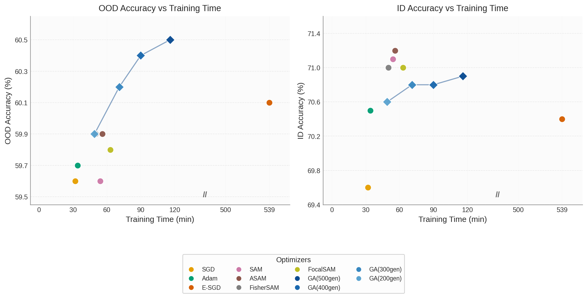
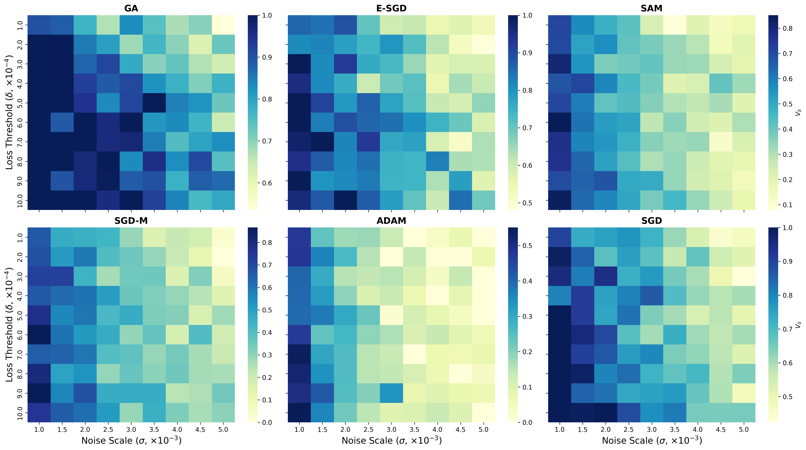

# for-reviewers
Supplementary materials for rebuttal.

	

**Figure 1. Convergence dynamics of GA-LoRA over 500 generations under an 8-shot setting(5 seeds).** The left axis denotes ID and OOD accuracy (the latter evaluated on ImageNet-v2 for effciency), while the right axis tracks the average-case sharpness $S_{\mathrm{avg}}$ sampled every 50 generations. ID accuracy increases rapidly during early generations, a phase often characterized by higher $S_{\mathrm{avg}}$ and notable fluctuations in OOD performance. As ID accuracy stabilizes, OOD accuracy tends to improve and consolidate, which correlates with the population moving toward flatter regions where $S_{\mathrm{avg}}$ is reduced and more stable. This downward trend in $S_{\mathrm{avg}}$ suggests a transition toward regions with lower sensitivity to parameter perturbations.

	

**Figure 2. Training time vs. accuracy trade-off across optimizers.**  
**(a)** OOD accuracy versus training time. GA exhibits a favorable robustness-efficiency trade-off across generation budgets, and even with 200 generations, its OOD performance remains competitive with SAM-based robust optimizers.  
**(b)** ID accuracy versus training time. Reducing GA to 200 generations yields only a minor ID accuracy drop, while retaining performance that still surpasses non-robust baselines such as Adam and SGD, at a training time comparable to SAM-based methods.

	

<b>Figure 3.</b> Viability Volume&nbsp; $V_{\delta}$ over noise scales&nbsp; $\sigma \in [0.001, 0.005]$ and loss thresholds&nbsp; $\delta \in [10^{-4}, 10^{-3}]$. Each heatmap reports $V_{\delta}$ (with $N=20$ Monte Carlo samples per cell), i.e., the probability that perturbations stay within the loss tolerance. GA consistently preserves the largest viable region, indicating a broader and more robust basin. SAM and E-SGD improve over SGD/Adam, but remain less stable than GA at higher noise.
