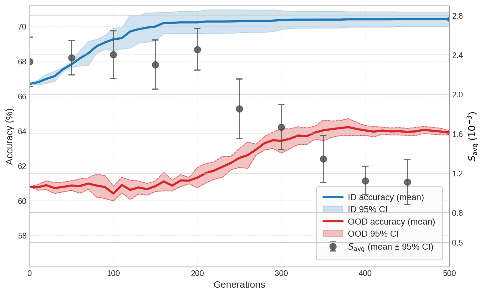

# for-reviewers
Supplementary materials for rebuttal.

**Figure 1. Convergence dynamics of GA-LoRA over 500 generations under an 8-shot setting(5 seeds).** The left axis denotes ID and OOD accuracy (the latter evaluated on ImageNet-v2 for effciency), while the right axis tracks the average-case sharpness $S_{\mathrm{avg}}$ sampled every 50 generations. ID accuracy increases rapidly during early generations, a phase often characterized by higher $S_{\mathrm{avg}}$ and notable fluctuations in OOD performance. As ID accuracy stabilizes, OOD accuracy tends to improve and consolidate, which correlates with the population moving toward flatter regions where $S_{\mathrm{avg}}$ is reduced and more stable. This downward trend in $S_{\mathrm{avg}}$ suggests a transition toward regions with lower sensitivity to parameter perturbations.
